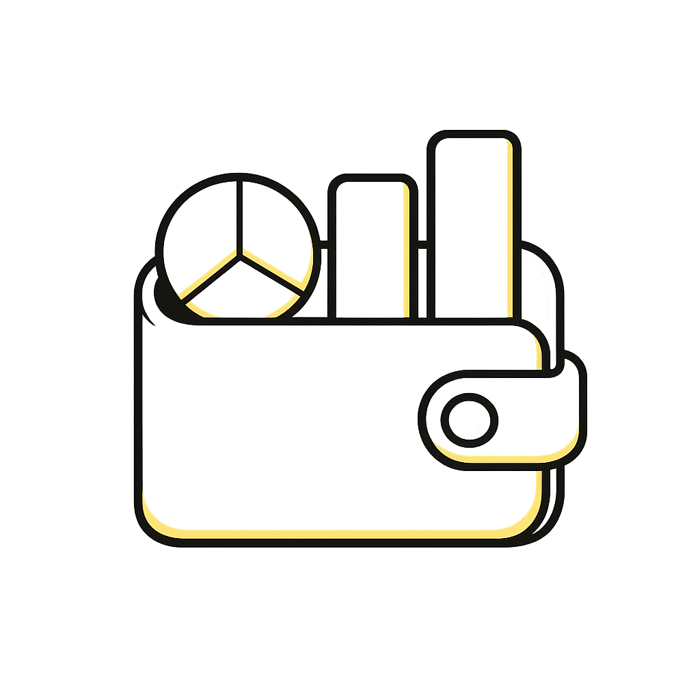

<p align="center">
  
</p>

<h1 align="center">Budgeter</h1>

<p align="center">
  Una PWA per pianificare, monitorare e proteggere il budget personale, con dati salvati solo nel browser.
</p>

<p align="center">
  <a href="https://dueffebudgeter.netlify.app">Apri la PWA pubblicata</a>
</p>

## Panoramica

Budgeter e una Progressive Web App pensata per gestire il budget mese per mese: imposti gli importi attesi, registri i movimenti reali e controlli subito quanto stai rispettando il piano. L'app lavora in locale, non richiede account e non invia i dati a server esterni.

## Funzionalita principali

- Budget mensile con navigazione per anno e mese.
- Categorie organizzate in entrate e risparmi, spese necessarie e sfizi.
- Importi attesi e movimenti effettivi per ogni categoria.
- Dashboard annuale con grafici comparativi tra pianificato e reale.
- Gestione categorie personalizzabile.
- Tema automatico, chiaro o scuro.
- Esportazione e importazione del database locale in JSON.
- Installazione come PWA su desktop e mobile.
- Service worker con cache dell'app shell per l'uso offline.

## Privacy

Budgeter usa `localStorage` del browser come archivio dati. Questo significa che:

- i dati restano sul dispositivo e nel browser in cui vengono inseriti;
- non c'e backend, login o sincronizzazione remota;
- per spostare i dati tra dispositivi puoi usare esportazione e importazione JSON;
- cancellando i dati del sito dal browser vengono rimossi anche i dati di Budgeter.

## Stack

- React 18
- Vite
- Tailwind CSS
- Recharts
- Lucide React
- Web Manifest + Service Worker

## Avvio in locale

Installa le dipendenze:

```bash
npm install
```

Avvia il server di sviluppo:

```bash
npm run dev
```

Crea la build di produzione:

```bash
npm run build
```

Prova la build in locale:

```bash
npm run preview
```

## Struttura del progetto

```text
budgeter/
├── public/
│   ├── logo.png
│   ├── manifest.webmanifest
│   └── sw.js
├── src/
│   ├── App.jsx
│   ├── main.jsx
│   └── styles.css
├── index.html
├── package.json
└── vite.config.js
```

## Pubblicazione

Il progetto genera una build statica nella cartella `dist/`, pronta per essere pubblicata su hosting come Netlify, Vercel, GitHub Pages o servizi equivalenti.

Quando la PWA sara online, sostituisci il link placeholder in alto:

```html
https://placeholder.example.com
```

con l'URL reale della pubblicazione.
